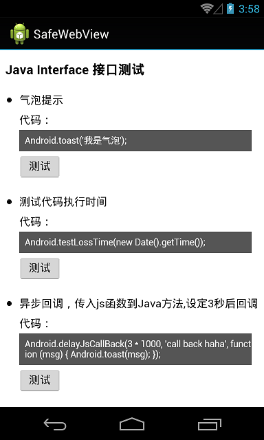

SafeWebView
===================
解决2个问题：

    1、WebView addJavascriptInterface安全漏洞问题；
    2、支持网页将JS函数（function）传到Java层，方便回调；

## 原理
    使用prompt中转反射调用Java层接口类中的方法，将方法名、参数类型、参数封装成Json进行传递；
    另参照：
    1、在WebView中如何让JS与Java安全地互相调用：http://www.pedant.cn/2014/07/04/webview-js-java-interface-research/，源码（20150621）：https://github.com/pedant/safe-java-js-webview-bridge
    2、Android WebView的Js对象注入漏洞解决方案：http://blog.csdn.net/leehong2005/article/details/11808557

## 用法

### 初始化Webview WebSettings时允许js脚本执行，SafeWebView内部重新了addJavascriptInterface和setWebChromeClient方法：

    WebView wv = new SafeWebView(this);
    WebSettings ws = wv.getSettings();
    ws.setJavaScriptEnabled(true);
    wv.addJavascriptInterface(new JavaScriptInterface(wv), "Android");
    wv.setWebChromeClient(new InnerChromeClient());
    wv.loadUrl("file:///android_asset/test.html");

### 自定义WebChromeClient子类

    public class InnerChromeClient extends SafeWebChromeClient {

        @Override
        public void onProgressChanged (WebView view, int newProgress) {
            super.onProgressChanged(view, newProgress); // 务必放在方法体的第一行执行；
            // to do your work
            // ...
        }

        @Override
        public boolean onJsPrompt(WebView view, String url, String message, String defaultValue, JsPromptResult result) {
            // to do your work
            // ...
            return super.onJsPrompt(view, url, message, defaultValue, result); // 务必放在方法体的最后一行执行，或者用if判断也行；
        }
    }

注意:由于JS中数字类型不区分整型、长整型、浮点类型等，是统一由64位浮点数表示，故Java方法在定义时int/long/double被当作是一种类型double；

### 关于异步回调
举例说明，首先你可以在Java层定义如下方法，该方法的作用是延迟设定的时间之后，用你传入的参数回调Js函数：
  
    @android.webkit.JavascriptInterface
    public void delayJsCallBack(final int ms, final String backMsg, final JsCallback jsCallback) {
        new Handler(Looper.getMainLooper()).postDelayed(new Runnable() {
            @Override
            public void run() {
                try {
                    jsCallback.apply(backMsg);
                } catch (JsCallback.JsCallbackException je) {
                    je.printStackTrace();
                }
            }
        }, ms);
    }

那么在网页端的调用如下：

    Android.delayJsCallBack(3 * 1000, 'call back haha', function (msg) {
      HostApp.alert(msg);
    });

即3秒之后会弹出你传入的'call back haha'信息。
故从上面的例子我们可以看出，你在网页端定义的回调函数是可以附加多个参数，Java方法在执行回调时需要带入相应的实参就行了。当然这里的**回调函数的参数类型目前还不支持过复杂的类型，仅支持能够被转为字符串的类型**。

另外需要注意的是一般传入到Java方法的js function是一次性使用的，即在Java层jsCallback.apply(...)之后不能再发起回调了。如果需要传入的function能够在当前页面生命周期内多次使用，请在第一次apply前**setPermanent(true)**。例如：

    @android.webkit.JavascriptInterface
    public void test (JsCallback jsCallback) {
        jsCallback.setPermanent(true);
        ...
    }

更多实现细节见: http://www.pedant.cn/2014/07/04/webview-js-java-interface-research/

### 发布时防混淆
发布时需在你的混淆配置加入像下面这样的代码，注意返回到页面的自定义Java类以及注入类都要**换成你项目中实际使用类名**:

    // 注入到页面的接口类防混淆
    -keepclassmembers class android.webkit.safe.sample.JavaScriptInterface{ *; }

## License

    The MIT License (MIT)

    Copyright (C) 2015 seven456@gmail.com

    Permission is hereby granted, free of charge, to any person obtaining a copy
    of this software and associated documentation files (the "Software"), to deal
    in the Software without restriction, including without limitation the rights
    to use, copy, modify, merge, publish, distribute, sublicense, and/or sell
    copies of the Software, and to permit persons to whom the Software is
    furnished to do so, subject to the following conditions:

    The above copyright notice and this permission notice shall be included in all
    copies or substantial portions of the Software.

    THE SOFTWARE IS PROVIDED "AS IS", WITHOUT WARRANTY OF ANY KIND, EXPRESS OR
    IMPLIED, INCLUDING BUT NOT LIMITED TO THE WARRANTIES OF MERCHANTABILITY,
    FITNESS FOR A PARTICULAR PURPOSE AND NONINFRINGEMENT. IN NO EVENT SHALL THE
    AUTHORS OR COPYRIGHT HOLDERS BE LIABLE FOR ANY CLAIM, DAMAGES OR OTHER
    LIABILITY, WHETHER IN AN ACTION OF CONTRACT, TORT OR OTHERWISE, ARISING FROM,
    OUT OF OR IN CONNECTION WITH THE SOFTWARE OR THE USE OR OTHER DEALINGS IN THE
    SOFTWARE.
